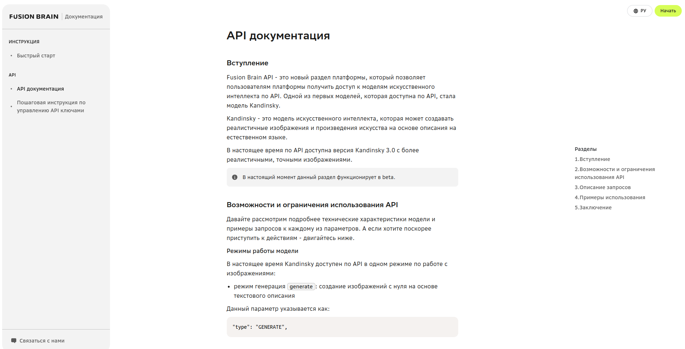
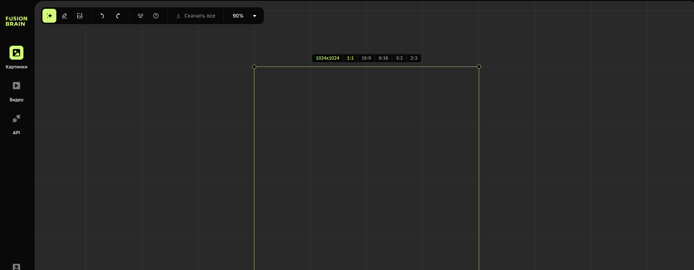
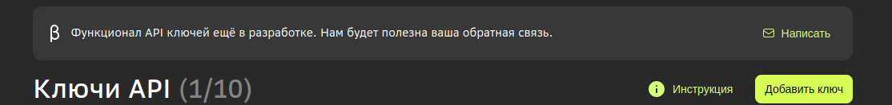

## Краткая инструкция по работе с проектом

### Шаг 1: Клонирование репозитория
Чтобы начать работу над проектом, сначала вам нужно клонировать его репозиторий. Для этого откройте терминал (или командную строку) и выполните следующую команду:

```bash
git clone git@github.com:VadimRoziznan/kandinsky.git
```

### Переход в папку проекта
После того, как вы клонировали репозиторий проекта, вам нужно перейти в папку с проектом. Для этого выполните следующие шаги:

1. Откройте терминал (или командную строку).
2. Перейдите в папку, где находится репозиторий проекта. Например, если вы клонировали репозиторий в папку "my-project", выполните команду:

```bash
cd kandinsky
```
### Создание виртуального окружения
Прежде чем начать работу с проектом, рекомендуется создать виртуальное окружение. Это позволит изолировать зависимости проекта от других проектов и системы, что сделает вашу работу более надежной и безопасной.

Чтобы создать виртуальное окружение, выполните следующие команду:

```bash
python -m venv .venv
```

### Активируйте виртуальное окружение. 
Если вы используете Unix-подобную систему (например, Linux или macOS), выполните команду:

```bash
source .venv/bin/activate
```

Если вы используете Windows, выполните команду:

```bash
.venv\Scripts\activate
```

Теперь вы находитесь в активированном виртуальном окружении. Вы увидите имя окружения в скобках в консоли. Например:

```bash
(.venv) $
```

Это означает, что вы работаете в виртуальном окружении ".venv".

### Установка зависимостей

Чтобы установить все необходимые библиотеки и пакеты для работы с проектом, выполните следующую команду в терминале:

```bash
pip install -r requirements.txt
```

### Шаг 2: Регистрация на сайте и получение API ключа

Перейдите на сайт, воспользуйтесь пошаговой инструкцией по получению API ключей.

[Fusion Brain](https://fusionbrain.ai/docs/)

Переходим к форме регистрации в правом верхнем углу жмем кнопку Начать.



После успешной регистрации попадаем в приложение, переходим в раздел API(левая боковая панель).



Добавляем новые ключи.



В корне вашего проекта создаём файл .env копируем в него содержимое файла .env_example, добавляем ключи.
